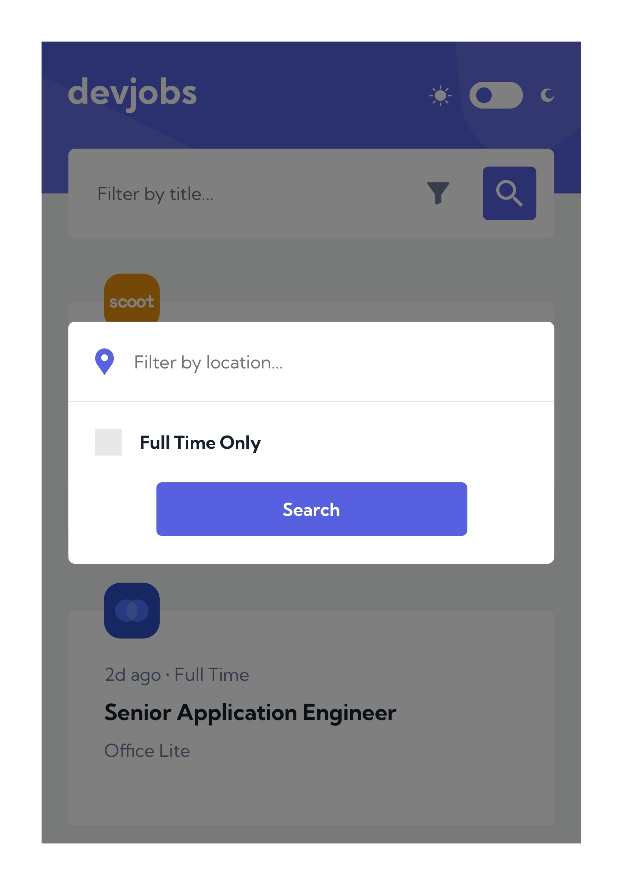
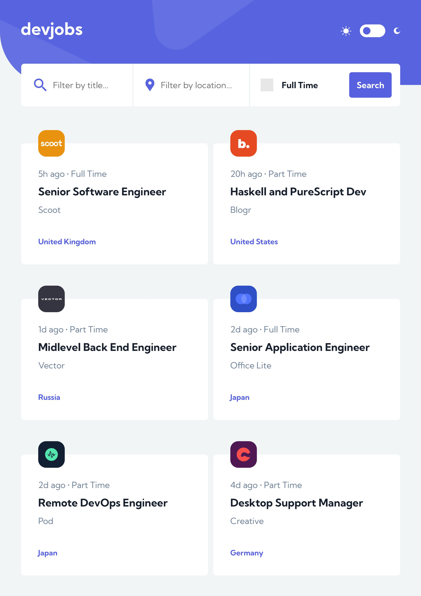
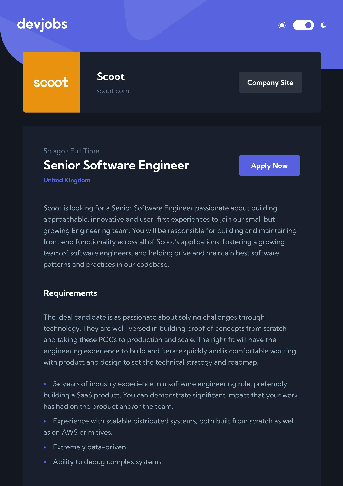

# Devjobs Web App

This is a demo project - Devjobs Web App.

## Table of contents

- [Overview](#overview)
  - [The Project](#the-project)
  - [Screenshots](#screenshots)
- [My process](#my-process)
  - [Built with](#built-with)
  - [What I learned](#what-i-learned)
  - [Useful resources](#useful-resources)
- [Author](#author)

## Overview

### The Project

Users should be able to:

- Be able to filter jobs on the index page by title, location, and whether a job is for a full-time position
- Be able to click a job from the index page so that they can read more information and apply for the job
- View the optimal layout for each page depending on their device's screen size
- See hover states for all interactive elements throughout the site
- Have the correct color scheme chosen for them based on their computer preferences.

### Screenshots







## My process

### Built with

- [React](https://react.dev/) - UI library
- [Next.js](https://nextjs.org/) - React metaframework
- [Sass/Scss](https://sass-lang.com/) - For styles
- [CSS-Modules](https://github.com/css-modules/css-modules) - For component-level CSS styles
- [Radix UI](https://www.radix-ui.com/) - A modal component with accessibility
- CSS Flexbox
- CSS Grid

### What I learned

While working through this project, I expanded my knowledge of light & dark modes, the modal overlaid on the primary window, controlled form inputs and dynamic URL routing.

```css
[data-theme='dark'] {
  // Home
  --background: hsl(220deg 29% 10%);
  --search-and-grid-background: hsl(219deg 29% 14%);
  --font-color: hsl(0deg 0% 100%);
  --unchecked-background: hsl(220deg 16% 23%);

  // Detail
  --intro-font-color: hsl(212deg 23% 69%);
  --button-font-color: hsl(0deg 0% 100%);
  --button-background: hsl(220deg 16% 22%);
  --hover-background: hsl(216deg 8% 35%);

  // Mobile Filter Icon
  --fill-color: hsl(0deg 0% 100%);
}
```

```js
function MobileSearchForm({
  handleSearchTitle,
  handleLocationAndFulltime,
}) {
  const [title, setTitle] = React.useState('');
  const [location, setLocation] = React.useState('');
  const [isfulltime, setIsfulltime] = React.useState(false);

  const [IsOpen, setIsOpen] = React.useState(false);

  const checkmarkclassName = `${styles.checkmark} ${
    isfulltime ? styles.checked : styles.unchecked
  }`;

  function handleSubmitTitle(event) {
    event.preventDefault();

    handleSearchTitle(title);

    setTitle('');
  }

  function handleLocationAndFullTime(event) {
    event.preventDefault();
    event.stopPropagation();
    setIsOpen(false);

    handleLocationAndFulltime(location, isfulltime);

    setLocation('');
    setIsfulltime(false);
  }

  return (
    <form onSubmit={handleSubmitTitle} className={styles.wrapper}>
      ...
    </form>
  );
}
```

### Useful resources

- [How To Customize Checkboxes](https://blog.openreplay.com/how-to-customize-checkboxes-with-css/) - This helped me with the customization of checkboxes.

## Author

- Website - [Jett Zhang](https://github.com/seamissu)
